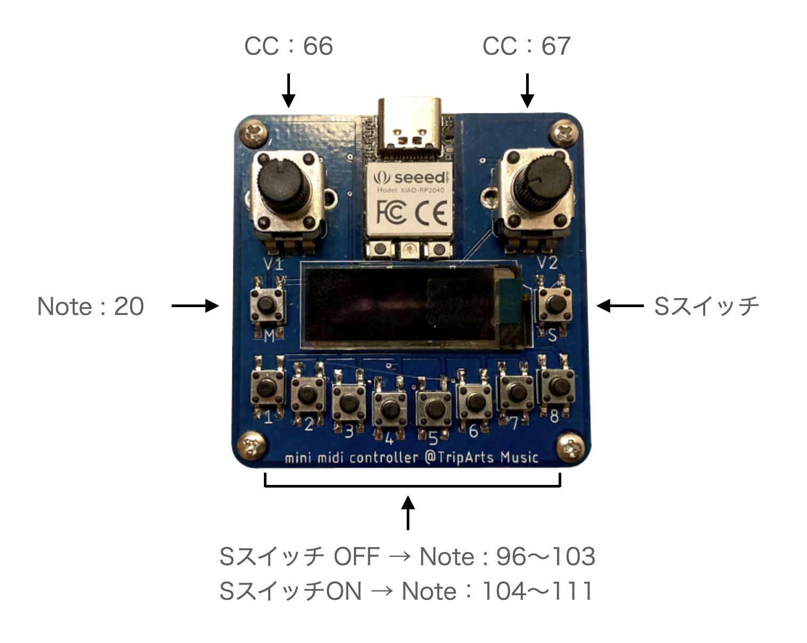

# mini midi controller

## source

[see](./arduino/mini-midi/)

## dependencies

1. https://wiki.seeedstudio.com/XIAO-RP2040-with-Arduino/
2. https://github.com/adafruit/Adafruit_TinyUSB_Arduino
3. https://github.com/adafruit/Adafruit-GFX-Library
4. https://github.com/adafruit/Adafruit_SSD1306

## License

MIT
